# RNode Documentation

## Overview

RNode is a decentralized blockchain platform developed by F1R3FLY.io that implements four distinct consensus mechanisms using the Rholang programming language. The platform provides concurrent smart contract execution with Byzantine Fault Tolerant operations across multiple shards for enhanced scalability and performance.

## System Architecture

### High-Level Operation with Shards

```mermaid
flowchart TD
    %% Client Layer
    subgraph Client["🌐 Client Layer"]
        direction LR
        Clients[👥 Client Applications<br/>Smart Contracts]
        Observers[👁️ Observer Nodes<br/>Read-Only Access]
    end
    
    %% Contract Deployment Entry Point
    Deploy[📤 Deploy Rholang Contract]
    
    %% Smart Contract Execution Flow
    subgraph Execution["⚙️ Smart Contract Execution Flow"]
        direction LR
        Propose[🔄 Propose Block]
        Execute[⚡ Concurrent Execution]
        Finalize[✅ Block Finalization]
        
        Propose --> Execute
        Execute --> Finalize
    end
    
    %% Shard Architecture
    subgraph Network["🔗 RNode Sharded Network"]
        direction TB
        
        subgraph Shard0["🏛️ Shard 0 (Root Shard)"]
            direction TB
            S0_Validators[👤 Validators 1-4]
            S0_Consensus[🎯 Multi-Consensus Engine]
            S0_RSpace[💾 RSpace Storage]
            
            S0_Validators --> S0_Consensus
            S0_Consensus --> S0_RSpace
        end
        
        subgraph Shard1["🏢 Shard 1"]
            direction TB
            S1_Validators[👤 Validators 1-3]
            S1_Consensus[🎯 Multi-Consensus Engine]
            S1_RSpace[💾 RSpace Storage]
            
            S1_Validators --> S1_Consensus
            S1_Consensus --> S1_RSpace
        end
        
        subgraph ShardN["🏭 Shard N"]
            direction TB
            SN_Validators[👤 Validators 1-3]
            SN_Consensus[🎯 Multi-Consensus Engine]
            SN_RSpace[💾 RSpace Storage]
            
            SN_Validators --> SN_Consensus
            SN_Consensus --> SN_RSpace
        end
    end
    
    %% Bitcoin Layer
    subgraph Bitcoin["₿ Bitcoin Network"]
        BTC[🔐 L1 Anchoring<br/>State Commitments]
    end
    
    %% Consensus Mechanisms (positioned left of Bitcoin)
    subgraph ConsensusTypes["🤝 Consensus Mechanisms"]
        direction LR
        CM[🌱 Cordial Miners<br/>Cooperative Mining]
        CBC[🛡️ Casper CBC<br/>BFT Consensus]
        RGB[🎨 RGB PSSM<br/>Client-Side Validation]
        CS[🚀 Casanova<br/>Adaptive Consensus]
    end
    
    %% Client Interactions
    Clients -->|Deploy Contracts| Deploy
    Observers -->|Read State| S0_RSpace
    Observers -->|Read State| S1_RSpace
    Observers -->|Read State| SN_RSpace
    
    %% Contract Assignment - Deploy routes to shards
    Deploy -->|Assign to Shard| S0_Consensus
    Deploy -->|Assign to Shard| S1_Consensus
    Deploy -->|Assign to Shard| SN_Consensus
    
    %% Execution Flow - triggered by consensus engines
    S0_Consensus --> Propose
    S1_Consensus --> Propose
    SN_Consensus --> Propose
    
    %% Consensus Selection (each shard can choose)
    S0_Consensus -.->|Selects| CM
    S0_Consensus -.->|Selects| CBC
    S0_Consensus -.->|Selects| RGB
    S0_Consensus -.->|Selects| CS
    
    S1_Consensus -.->|Selects| CM
    S1_Consensus -.->|Selects| CBC
    S1_Consensus -.->|Selects| RGB
    S1_Consensus -.->|Selects| CS
    
    SN_Consensus -.->|Selects| CM
    SN_Consensus -.->|Selects| CBC
    SN_Consensus -.->|Selects| RGB
    SN_Consensus -.->|Selects| CS
    
    %% Cross-Shard Communication
    S0_Consensus <-.->|Cross-Shard Messages| S1_Consensus
    S0_Consensus <-.->|Cross-Shard Messages| SN_Consensus
    S1_Consensus <-.->|Cross-Shard Messages| SN_Consensus
    
    %% State Updates
    Execute -->|State Updates| S0_RSpace
    Execute -->|State Updates| S1_RSpace
    Execute -->|State Updates| SN_RSpace
    
    %% Bitcoin Anchoring
    S0_RSpace -->|Periodic Commitments| BTC
    S1_RSpace -->|Periodic Commitments| BTC
    SN_RSpace -->|Periodic Commitments| BTC
    
    
    %% Dark theme optimized styling
    classDef client fill:#2d3748,stroke:#63b3ed,stroke-width:3px,color:#ffffff
    classDef deploy fill:#2d3748,stroke:#f6ad55,stroke-width:4px,color:#ffffff
    classDef execution fill:#2d3748,stroke:#f6ad55,stroke-width:3px,color:#ffffff
    classDef consensus fill:#2d3748,stroke:#9f7aea,stroke-width:3px,color:#ffffff
    classDef shard fill:#1a202c,stroke:#4fd1c7,stroke-width:3px,color:#ffffff
    classDef validator fill:#2d3748,stroke:#68d391,stroke-width:2px,color:#ffffff
    classDef storage fill:#2d3748,stroke:#fc8181,stroke-width:2px,color:#ffffff
    classDef bitcoin fill:#2d3748,stroke:#fbb040,stroke-width:3px,color:#ffffff
    classDef network fill:#1a202c,stroke:#4fd1c7,stroke-width:2px,color:#ffffff
    classDef consensusBox fill:#22543d88,stroke:#9f7aea,stroke-width:2px,color:#ffffff
    classDef executionBox fill:#2d5a8788,stroke:#63b3ed,stroke-width:2px,color:#ffffff
    
    class Clients,Observers client
    class Deploy deploy
    class Propose,Execute,Finalize execution
    class CM,CBC,RGB,CS consensus
    class S0_Consensus,S1_Consensus,SN_Consensus consensus
    class S0_Validators,S1_Validators,SN_Validators validator
    class S0_RSpace,S1_RSpace,SN_RSpace storage
    class BTC bitcoin
    class Shard0,Shard1,ShardN,Network network
    class ConsensusTypes consensusBox
    class Execution executionBox
```

### Key Architecture Components

#### **Sharding Model**
- **Root Shard (Shard 0)**: Coordinates cross-shard operations and maintains global state
- **Child Shards**: Process transactions independently with periodic synchronization
- **Cross-Shard Communication**: Secure message passing between shards
- **State Finality**: Coordinated finalization across all shards

#### **Multi-Consensus Engine**
Each shard can independently select and switch between four consensus mechanisms:
- **Cordial Miners**: Energy-efficient cooperative mining
- **Casper CBC**: Byzantine Fault Tolerant with mathematical safety proofs
- **RGB PSSM**: Client-side validation with Bitcoin L1 anchoring
- **Casanova**: Adaptive consensus optimizing for current network conditions

#### **RSpace Tuple Space**
- **Concurrent Storage**: Each shard maintains its own RSpace instance
- **Cross-Shard Queries**: Ability to query state across multiple shards
- **State Synchronization**: Coordinated state updates and consistency guarantees
- **Bitcoin Anchoring**: Periodic state commitments to Bitcoin for additional security

## Documentation Structure

### =� Requirements
- **[Requirements Overview](requirements/)** - Business and user requirements
  - **[User Stories](requirements/user-stories/)** - Feature requirements from user perspective
  - **[Business Requirements](requirements/business-requirements/)** - Business logic and constraints
  - **[Acceptance Criteria](requirements/acceptance-criteria/)** - Definition of done for features

### =� Specifications  
- **[Specifications Overview](specifications/)** - Technical specifications and design documents
  - **[Technical Specifications](specifications/technical/)** - API specs, data schemas, algorithms
  - **[Visual Design](specifications/visual-design/)** - UI/UX mockups and style guides
  - **[Integration Specifications](specifications/integration/)** - Third-party service integrations

### <� Architecture
- **[Architecture Overview](architecture/)** - System design and architectural decisions
  - **[Architecture Decision Records](architecture/decisions/)** - ADRs documenting key decisions
  - **[System Diagrams](architecture/diagrams/)** - Component diagrams and data flows
  - **[Design Patterns](architecture/patterns/)** - Established patterns and conventions

### =� API Documentation
- **[API Overview](api/)** - Complete API reference and examples
  - **[Node Operations](api/node-operations.md)** - Core node functionality
  - **[Smart Contracts](api/smart-contracts.md)** - Contract deployment and execution
  - **[Consensus APIs](api/consensus-apis.md)** - Multi-consensus management
  - **[Network APIs](api/network-apis.md)** - P2P networking operations

###  Current Status
- **[Project Status](ToDos.md)** - Live project status, active tasks, and priorities

## Quick Navigation

### For New Developers
1. **[Getting Started](../README.md#installation)** - Environment setup
2. **[Developer Guide](../DEVELOPER.md)** - Development workflow
3. **[API Documentation](api/)** - API reference and examples
4. **[Architecture Overview](architecture/)** - System design understanding

### For Node Operators
1. **[Node Operations](requirements/user-stories/US-CORE-001-node-operator.md)** - Operator requirements
2. **[Deployment Guide](../README.md#running)** - Node deployment
3. **[Configuration](../README.md#configuration)** - Node configuration options
4. **[Troubleshooting](../README.md#troubleshooting)** - Common issues and solutions

### For Smart Contract Developers
1. **[Contract Development](requirements/user-stories/US-SMART-001-developer-deploy.md)** - Developer workflow
2. **[Rholang Language](specifications/technical/SPEC-LANG-001-rholang.md)** - Language specification
3. **[CLI Tools](../node-cli/README.md)** - Command-line interface
4. **[Examples](../rholang/examples/)** - Contract examples

### For Researchers & Contributors
1. **[Multi-Consensus Architecture](architecture/decisions/ADR-002-multi-consensus-architecture.md)** - Consensus design
2. **[Contributing Guide](../CONTRIBUTING.md)** - Contribution workflow
3. **[Technical Specifications](specifications/technical/)** - Detailed technical specs
4. **[Current Development Status](ToDos.md)** - Active development tasks

## Development Resources

### Key Technologies
- **Languages**: Scala (node), Rust (performance), Rholang (contracts)
- **Consensus**: Cordial Miners, Casper CBC, RGB PSSM, Casanova
- **Storage**: RSpace tuple space with LMDB backend
- **Networking**: gRPC with TLS 1.3, P2P with Kademlia DHT
- **Environment**: Nix/Direnv for reproducible development

### External Resources
- **[F1R3FLY Discord](https://discord.gg/NN59aFdAHM)** - Community support and discussions
- **[Bitcoin Anchoring](../bitcoin-anchor/README.md)** - Layer 1 security integration
- **[RNodeFS](https://github.com/F1R3FLY-io/rnodefs#rnodefs)** - File system built on RNode
- **[Docker Hub](https://hub.docker.com/r/f1r3flyindustries/rnode-rust-node)** - Container images

## Contributing to Documentation

This documentation follows F1R3FLY.io's documentation-first development methodology. When contributing:

1. **Requirements First**: Start with user stories and business requirements
2. **Specifications**: Create detailed technical specifications
3. **Architecture**: Document architectural decisions with ADRs
4. **Implementation**: Build according to documented specifications
5. **Update Status**: Keep `ToDos.md` current with progress

For specific contribution guidelines, see our **[Contributing Guide](../CONTRIBUTING.md)**.