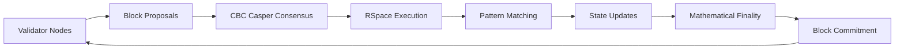
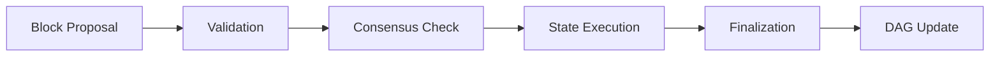
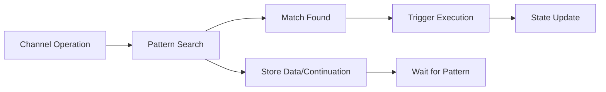
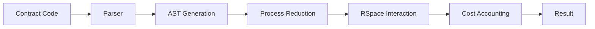
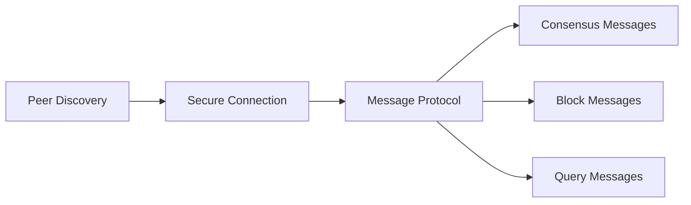
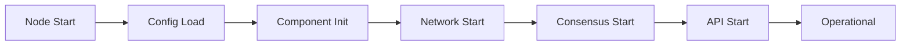
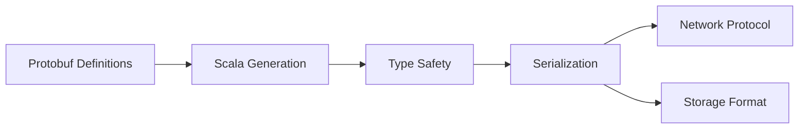
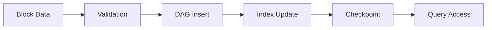
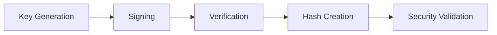

# F1R3FLY Node Architecture Documentation

## Overall Consensus & Network Operations

F1R3FLY implements an advanced blockchain architecture that solves fundamental scalability and determinism challenges through CBC Casper consensus and concurrent execution.

**Core Innovation:**
F1R3FLY achieves what traditional blockchains cannot: **massively parallel transaction processing with guaranteed deterministic outcomes**. Unlike sequential blockchains (Bitcoin, Ethereum), F1R3FLY can process thousands of transactions concurrently while ensuring every validator node reaches identical state.

**Architecture Pillars:**
- **CBC Casper** (Correct-by-Construction Casper): Provably safe consensus protocol with finality guarantees based on [Ethereum's CBC Casper research](https://rholang.org/docs/cbc-protocol/)
- **Concurrent Deterministic Execution**: [RSpace tuple space](https://rholang.org/docs/rspace-intro/) enables lock-free parallel processing with confluent reductions ensuring deterministic outcomes
- **Pattern Matching Coordination**: Advanced pattern matching system coordinates cross-process communication and state updates
- **Mathematical Finality**: Blocks achieve finality through safety oracle computations with fault tolerance thresholds, providing deterministic rather than probabilistic confirmation

**Network Deployment:**
The system scales seamlessly from development environments to large production networks with thousands of validator nodes. The architecture's concurrent nature means performance increases with available hardware rather than being limited by sequential bottlenecks. For testing and development, smaller networks can be deployed as needed.

**Enhanced Consensus & Execution Flow:**
Validator nodes propose blocks → CBC Casper mathematical consensus → Parallel RSpace execution → Pattern matching coordination → Deterministic state convergence → Mathematical finality → Block commitment

---

## Project Structure & Component Analysis

### `casper/` - Consensus Engine

Implements CBC Casper consensus protocol for distributed blockchain consensus based on [Ethereum's CBC Casper research](https://rholang.org/docs/cbc-protocol/).

**Key Features:**
- Block creation, validation, and finalization using clique oracle safety calculations
- PoS (Proof of Stake) validator management with staking and slashing
- Equivocation detection and byzantine fault tolerance
- Safety and liveness guarantees through CBC protocol design with mathematical finality thresholds

**Relationships:** Uses `rspace` and `rholang` for state execution, `comm` for network coordination, `block-storage` for persistence, `models` for data structures.

### `rspace/` - Tuple Space Storage

Concurrent pattern-matching storage system enabling deterministic parallel execution. Based on the [RSpace tuple space concept](https://rholang.org/docs/rspace-intro/) that departs from traditional key-value stores.

**Key Features:**
- Channel-based data association rather than key-value pairs
- Concurrent operations with fine-grained locking
- Pattern matching for data retrieval with custom match functions
- Continuation storage and execution for asynchronous operations
- Checkpointing and state management

**Relationships:** Core storage used by `rholang` execution, `casper` state transitions, provides persistence layer for smart contracts.

### `rholang/` - Smart Contract Runtime

π-calculus based concurrent programming language for blockchain smart contracts. See [Rholang documentation](https://rholang.org/docs/rholang/) for language specifications and examples.

**Key Features:**
- Process calculus concurrent execution with message passing
- Channel-based communication in distributed systems
- Pattern matching integration with RSpace
- Cost accounting with phlogiston for resource management
- Completely asynchronous execution model

**Relationships:** Executes on `rspace` storage, used by `casper` for state transitions, `node` for contract deployment, `models` for data representation.

### `comm/` - Network Communication

P2P networking layer handling secure node communication.

**Key Features:**
- Kademlia DHT (Distributed Hash Table) for peer discovery
- gRPC transport with TLS (Transport Layer Security) encryption
- Message protocol handling
- Connection management

**Relationships:** Transports `casper` consensus messages, enables `node` peer connections, secure protocol defined in `models`.

### `node/` - Main Application

Central orchestrator integrating all components into executable blockchain node.

**Key Features:**
- Component initialization and lifecycle
- Configuration management
- API server hosting (gRPC, HTTP)
- Node health monitoring

**Relationships:** Integrates `casper`, `rholang`, `rspace`, `comm`, `crypto` into complete node, provides external interfaces.

### `models/` - Data Structures

Protobuf-based data models and type definitions.

**Key Features:**
- Blockchain data structures (blocks, transactions)
- Network protocol messages
- Type-safe serialization
- Cross-component data contracts

**Relationships:** Used by all components for data representation, `casper` block structures, `comm` protocol messages, `rholang` data types.

### `block-storage/` - Persistent Storage

Manages blockchain data persistence and retrieval.

**Key Features:**
- Block DAG (Directed Acyclic Graph) storage
- Efficient query operations
- State checkpointing
- Historical data access

**Relationships:** Stores data from `casper` consensus, provides data to `node` APIs, interfaces with `models` for data structures.

### `crypto/` - Cryptographic Operations

Cryptographic primitives and security functions.

**Key Features:**
- Digital signatures (Ed25519)
- Hash functions (Blake2b)
- Key management
- Cryptographic verification

**Relationships:** Used by `casper` for block signing, `comm` for secure transport, `node` for validator identity, `rholang` for cryptographic operations.

### `shared/` - Common Utilities

Shared utility functions and common dependencies.

**Key Features:**
- Logging and monitoring
- Utility functions
- Common type classes
- Base functionality

**Relationships:** Foundation library used by all other components for common operations and utilities.

---

## Technical Foundations & References

### Consensus Protocol Research

F1R3FLY's consensus mechanism is based on **CBC Casper** (Correct-by-Construction Casper), originally developed by Ethereum researchers. The protocol provides:

- **Mathematical Finality**: Unlike probabilistic consensus mechanisms, CBC Casper achieves finality through fault tolerance calculations and safety oracle computations
- **Byzantine Fault Tolerance**: Handles up to 1/3 malicious validators through equivocation detection and slashing
- **Proof-of-Stake Security**: Economic incentives align validator behavior with network security

**Key Resources:**
- [CBC Protocol Documentation](https://rholang.org/docs/cbc-protocol/) - Technical overview of the Correct-by-Construction Casper protocol
- [RChain Whitepaper](https://rchain.coop/whitepaper.html) - Complete technical specification and research foundations

### RSpace Tuple Space

The **RSpace** storage system revolutionizes blockchain state management through:

- **Concurrent Operations**: Multiple transactions can execute simultaneously without conflicts
- **Pattern Matching**: Advanced matching system for coordinating processes and data retrieval
- **Deterministic Outcomes**: Despite concurrent execution, all nodes reach identical final states

**Key Resources:**
- [RSpace Documentation](https://rholang.org/docs/rspace-intro/) - Detailed explanation of the tuple space implementation
- Technical implementation diverges from traditional key-value stores by using channel-based data association

### Rholang Programming Language

**Rholang** enables the concurrent smart contract execution that powers F1R3FLY's scalability:

- **Process-Oriented**: All computation occurs through message passing between processes
- **Asynchronous by Design**: No blocking operations, enabling true parallelism
- **Channel-Based**: Communication occurs via named channels rather than shared memory

**Key Resources:**
- [Rholang Documentation](https://rholang.org/docs/rholang/) - Language specification, syntax, and programming examples
- Based on π-calculus formal foundations for concurrent and distributed systems

### Architecture Presentations

For visual understanding of the F1R3FLY blockchain structure:
- [RChain Blockchain Structure Presentation](https://docs.google.com/presentation/d/1znz01SF1ljriPzbMoFV0J127ryPglUYLFyhvsb-ftQk/edit?slide=id.p#slide=id.p)
- [Additional Technical Documentation](https://drive.google.com/file/d/1_M6xBXHdMo4-VCm5oNOWdKLjM2zJPReF/view)
