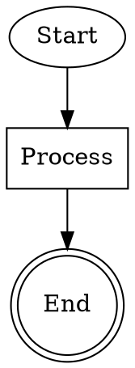

# Graphz - Rust

A Rust library for generating Graphviz diagrams, ported from the original Scala implementation.

## Overview

Graphz is a library for creating Graphviz diagrams programmatically in Rust. It provides a clean, asynchronous API for building graphs, digraphs, and subgraphs with various formatting options.

## Features

- **Asynchronous API**: All operations are async-friendly using `tokio`
- **Multiple output formats**: String, list, and file serialization
- **Graph types**: Support for both graphs and directed graphs (digraphs)
- **Subgraph support**: Create nested subgraphs with custom properties
- **Rich formatting**: Comprehensive support for node shapes, styles, colors, and edge attributes
- **Faithful port**: API closely follows the original Scala implementation

## Installation

Add this to your `Cargo.toml`:

```toml
[dependencies]
graphz = { path = "../graphz" }
tokio = { version = "1", features = ["full"] }
```

## Basic Usage

```rust
use graphz::rust::graphz::{apply, GraphShape, GraphType, StringSerializer};
use std::sync::Arc;
use std::collections::HashMap;

#[tokio::main]
async fn main() -> Result<(), Box<dyn std::error::Error>> {
    // Create a serializer
    let serializer = Arc::new(StringSerializer::new());

    // Create a directed graph
    let graph = apply(
        "MyGraph".to_string(),
        GraphType::DiGraph,
        serializer.clone(),
        false,                           // subgraph
        Some("This is my graph".to_string()), // comment
        None,                            // label
        None,                            // splines
        None,                            // rank
        None,                            // rankdir
        None,                            // style
        None,                            // color
        HashMap::new(),                  // node attributes
    ).await?;

    // Add nodes
    graph.node("Start", GraphShape::Circle, None, None, None).await?;
    graph.node("Process", GraphShape::Box, None, None, None).await?;
    graph.node("End", GraphShape::DoubleCircle, None, None, None).await?;

    // Add edges
    graph.edge("Start", "Process", None, None, None).await?;
    graph.edge("Process", "End", None, None, None).await?;

    // Close the graph
    graph.close().await?;

    // Get the generated Graphviz code
    println!("{}", serializer.get_content().await);

    Ok(())
}
```

This will output:


## Graph Types

### Basic Graph
```rust
let graph = apply(
    "G".to_string(),
    GraphType::Graph,
    serializer.clone(),
    false,
    None,
    None,
    None,
    None,
    None,
    None,
    None,
    HashMap::new(),
).await?;
```

### Directed Graph (DiGraph)
```rust
let graph = apply(
    "G".to_string(),
    GraphType::DiGraph,
    serializer.clone(),
    false,
    None,
    None,
    None,
    None,
    None,
    None,
    None,
    HashMap::new(),
).await?;
```

## Node Shapes

Supported shapes:
- `Circle` (default)
- `DoubleCircle`
- `Box`
- `PlainText`
- `Msquare`
- `Record`

## Edge Methods

### Simple edge
```rust
graph.edge("A", "B", None, None, None).await?;
```

### Edge with tuple syntax
```rust
graph.edge_tuple(("A".to_string(), "B".to_string())).await?;
```

### Edge with attributes
```rust
use graphz::rust::graphz::{GraphStyle, GraphArrowType};

graph.edge(
    "A", "B",
    Some(GraphStyle::Dotted),
    Some(GraphArrowType::InvArrow),
    Some(false)  // constraint
).await?;
```

## Subgraphs

```rust
use graphz::rust::graphz::{subgraph, GraphRank};

let my_subgraph = subgraph(
    "cluster_1".to_string(),
    GraphType::DiGraph,
    serializer.clone(),
    Some("My Subgraph".to_string()),  // label
    Some(GraphRank::Same),            // rank
    None,                             // rankdir
    None,                             // style
    Some("blue".to_string()),         // color
).await?;
```

## Serializers

### StringSerializer
Collects output in a string buffer:
```rust
let serializer = Arc::new(StringSerializer::new());
// ... build graph ...
let content = serializer.get_content().await;
```

### ListSerializer
Collects output as a vector of lines:
```rust
let serializer = Arc::new(ListSerializer::new());
// ... build graph ...
let lines = serializer.get_lines().await;
```

### FileSerializer
Writes output directly to a file:
```rust
let file = tokio::fs::File::create("output.dot").await?;
let serializer = Arc::new(FileSerializer::new(file).await);
```

## Graph Attributes

### Rank Direction
```rust
use graphz::rust::graphz::GraphRankDir;

let graph = apply(
    "G".to_string(),
    GraphType::DiGraph,
    serializer.clone(),
    false,
    None,
    None,
    None,
    None,
    Some(GraphRankDir::TB),  // Top to Bottom
    None,
    None,
    HashMap::new(),
).await?;
```

Available options:
- `TB` (Top to Bottom)
- `BT` (Bottom to Top)  
- `LR` (Left to Right)
- `RL` (Right to Left)

### Rank
```rust
use graphz::rust::graphz::GraphRank;

let subgraph = subgraph(
    "".to_string(),
    GraphType::DiGraph,
    serializer.clone(),
    None,
    Some(GraphRank::Same),
    None,
    None,
    None,
).await?;
```

Available options:
- `Same`
- `Min`
- `Source`
- `Max`
- `Sink`

## API Reference

### Main Functions

- `apply(...)` - Creates a new graph with full configuration options
- `subgraph(...)` - Creates a subgraph with common configuration options
- `default_shape()` - Returns the default node shape (Circle)

### Graph Methods

- `node(name, shape, style, color, label)` - Add a node with attributes
- `edge(src, dst, style, arrow_head, constraint)` - Add an edge with attributes
- `edge_tuple(tuple)` - Add an edge using tuple syntax
- `close()` - Close the graph and generate final output

### Types

- `GraphType`: `Graph`, `DiGraph`
- `GraphShape`: `Circle`, `DoubleCircle`, `Box`, `PlainText`, `Msquare`, `Record`
- `GraphStyle`: `Solid`, `Bold`, `Filled`, `Invis`, `Dotted`, `Dashed`
- `GraphArrowType`: `NormalArrow`, `InvArrow`, `NoneArrow`
- `GraphRank`: `Same`, `Min`, `Source`, `Max`, `Sink`
- `GraphRankDir`: `TB`, `BT`, `LR`, `RL`

## Testing

Run tests with:
```bash
cargo test
```

All tests are faithful ports of the original Scala tests and verify that the output matches exactly.

## Original Scala Implementation

This library is a faithful port of the original Scala graphz library. The API closely follows the original design while adapting to Rust's ownership model and async paradigms. All function signatures and behavior match the Scala implementation.

## License

This project follows the same license as the original Scala implementation. 